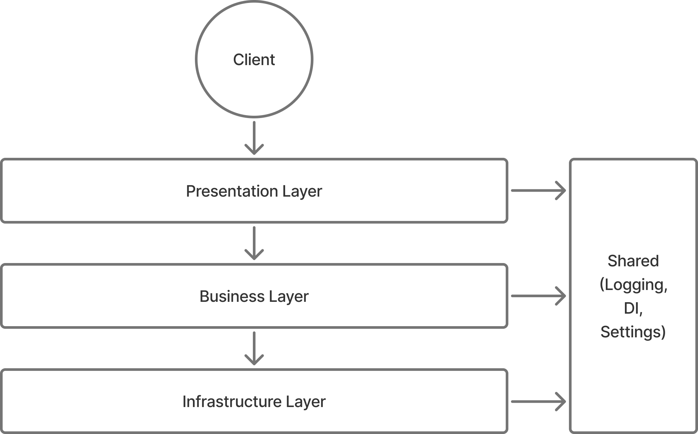
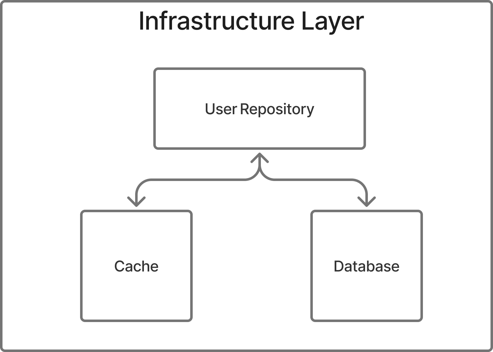
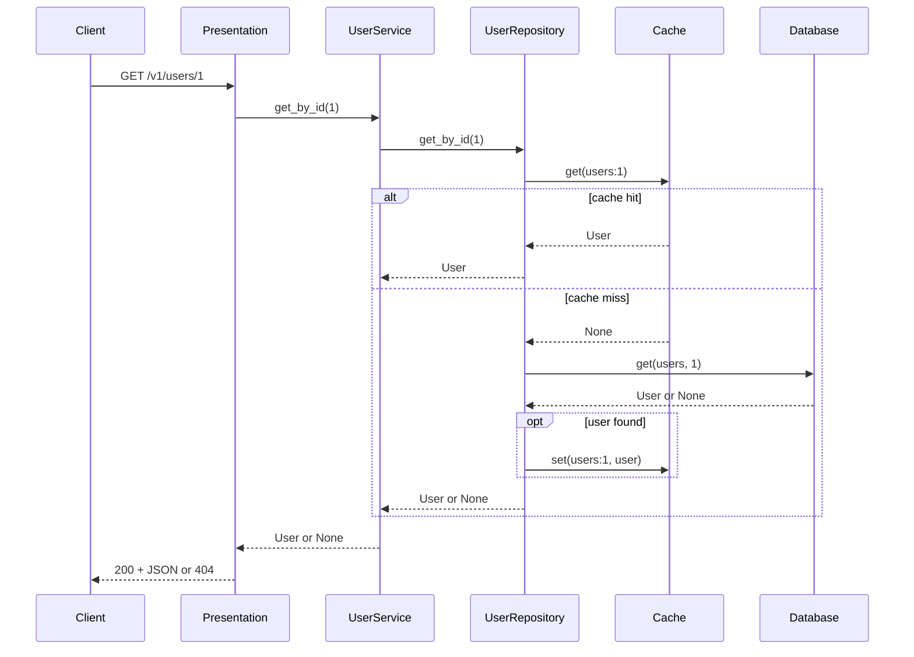

# User Service

A FastAPI microservice that exposes user profile data with an in-memory repository (TTL-based expiry), structlog logging, and dependency injection.

## Architecture

The service follows a **layered architecture** with clear separation between HTTP handling, business logic, and infrastructure. Dependency injection is used so the same API runs with an in-memory repository.

### High-level layers


### Request flow (e.g. GET /v1/users/{id})





### Layer responsibilities

| Layer | Location | Responsibility |
|-------|----------|----------------|
| **Presentation** | `src/presentation/api/v1/` | HTTP: FastAPI routers (`router.py`, `users.py`), request/response mapping, status codes (e.g. 404), and request-logging middleware. Depends only on the business layer via DI (`UserService`). |
| **Business** | `src/business/` | Application logic: `UserService` orchestrates the repository. Domain models and DTOs (`User`, `CreateUserRequest`, `UpdateUserRequest`) live in `business/models/`. No HTTP or storage details. |
| **Infrastructure** | `src/infra/` | **UserRepository** uses **Cache** (in-memory, TTL) and **Database** (persistent storage). Cache is checked first on reads; on miss, data is loaded from the database and written to the cache. Writes go to the database and refresh the cache. |
| **Shared** | `src/shared/` | Re-exported models for API, `settings` (env vars), dependency injection (`di`: structlog, cache, database, repository, service wiring, and FastAPI app factory). |

### Runtime wiring (`main.py` and `src/shared/di.py`)

- **Cache:** `InMemoryCache` with configurable TTL (`CACHE_TTL_SECONDS`, default 60). Used by `UserRepository` for GET-by-id (and refreshed on create/update).
- **Database:** `InMemoryUserDatabase` holds persistent user data; repository reads/writes go through it, with cache in front for reads.
- **UserRepository** is built with `cache` and `database`; `UserService` is built with the repository. Both are attached via `singletons`; routes use `singletons.user_service`.
- The FastAPI app is created by `get_fastapi_app()`: request-logging middleware, `GET /` health-style root, and the v1 router (prefix `/v1`).

## Features

- **Endpoints:** `GET /v1/users`, `GET /v1/users/{user_id}`, `POST /v1/users`, `PATCH /v1/users/{user_id}`, and `GET /` (status).
- **Cache:** In-memory cache with configurable TTL (default 60s). GET-by-id checks the cache first; on miss, data is loaded from the database and stored in the cache. PATCH and POST refresh the cache for the affected user.
- **Database:** Persistent storage for users; the repository reads from and writes to the database, with the cache in front for GET-by-id.
- **Logging:** structlog (request start/finish in middleware; cache hits/misses, user operations, and errors in routes).

**Requirements:** Python 3.14+ (mise defaults to 3.14). Dependencies are managed with [uv](https://docs.astral.sh/uv/).

## Run locally

1. Install dependencies:

   ```bash
   mise run install
   ```

   or:

   ```bash
   uv sync
   ```

2. Start the application:

   ```bash
   mise run start
   ```

   The API is available at `http://localhost:8000`.  
   Swagger docs at `http://localhost:8000/docs`.

## Lint

```bash
mise run lint
```

## Environment variables

| Variable              | Description                                   | Default   |
|-----------------------|-----------------------------------------------|-----------|
| `CACHE_TTL_SECONDS`   | TTL for in-memory user entries (seconds)      | 60        |
| `SERVER_HOST`         | Bind host for uvicorn                         | 0.0.0.0   |
| `SERVER_PORT`         | Bind port                                     | 8000      |
| `SERVER_RELOAD`       | Enable uvicorn reload                         | true      |
| `APP_TITLE`           | Application title                             | User Service |

## API summary

| Method | Path                | Description                          |
|--------|---------------------|--------------------------------------|
| GET    | `/`                 | Status: `{"status": "ok", "service": "User Service"}` |
| GET    | `/v1/users`         | List all users                       |
| GET    | `/v1/users/{user_id}` | Get user by ID (404 if not found)  |
| POST   | `/v1/users`         | Create user (validates input)        |
| PATCH  | `/v1/users/{user_id}` | Partial update; repository refreshed for that entry |

## Data model

- **User:** `id` (int), `name` (str), `email` (EmailStr), `age` (optional int, > 0).
- **POST body (CreateUserRequest):** `name`, `email`, `age` (optional, > 0).
- **PATCH body (UpdateUserRequest):** any subset of `name`, `email`, `age` (optional, > 0).
