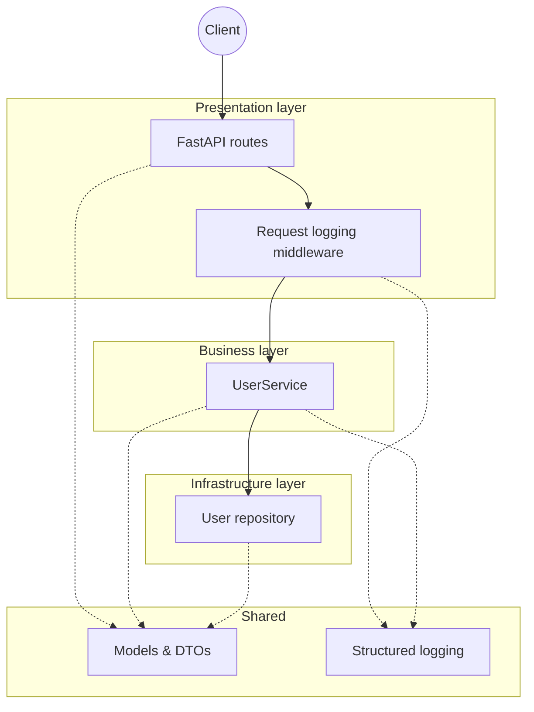
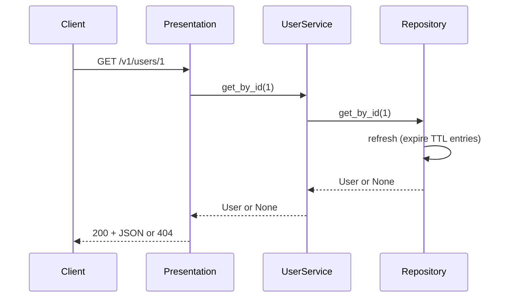

# User Service

A FastAPI microservice that exposes user profile data with an in-memory repository (TTL-based expiry), structlog logging, and dependency injection.

## Architecture

The service follows a **layered architecture** with clear separation between HTTP handling, business logic, and infrastructure. Dependency injection is used so the same API runs with an in-memory repository.

### High-level layers



### Request flow (e.g. GET /v1/users/{id})



### Layer responsibilities

| Layer | Location | Responsibility |
|-------|----------|----------------|
| **Presentation** | `src/presentation/api/v1/` | HTTP: FastAPI routers (`router.py`, `users.py`), request/response mapping, status codes (e.g. 404), and request-logging middleware. Depends only on the business layer via DI (`UserService`). |
| **Business** | `src/business/` | Application logic: `UserService` orchestrates the repository. Domain models and DTOs (`User`, `CreateUserRequest`, `UpdateUserRequest`) live in `business/models/`. No HTTP or storage details. |
| **Infrastructure** | `src/infra/repositories/` | Abstract `UserRepository` and concrete `InMemoryUserRepository` with TTL-based expiry and refresh on read/update. |
| **Shared** | `src/shared/` | Cross-cutting: re-exported models for API, `settings` (env vars), `di` (structlog, repository, service wiring, and FastAPI app factory). |

### Runtime wiring (`main.py` and `src/shared/di.py`)

- **In-memory** `InMemoryUserRepository` with configurable TTL (`CACHE_TTL_SECONDS`, default 60). Entries are refreshed (expired ones removed) on every read and on update.
- `UserService` is built with the repository and attached via `singletons.user_service`; routes use it from `src.shared.di.singletons`.
- The FastAPI app is created by `get_fastapi_app()`: request-logging middleware, `GET /` health-style root, and the v1 router (prefix `/v1`).

## Features

- **Endpoints:** `GET /v1/users`, `GET /v1/users/{user_id}`, `POST /v1/users`, `PATCH /v1/users/{user_id}`, and `GET /` (status).
- **Storage & TTL:** In-memory repository with configurable TTL (default 60s); entries expire and are removed on refresh (on each read and on PATCH).
- **Persistence:** In-memory only; data does not survive app restarts.
- **Logging:** structlog (request start/finish in middleware; user operations and errors in routes).

**Requirements:** Python 3.14+ (mise defaults to 3.14). Dependencies are managed with [uv](https://docs.astral.sh/uv/).

## Run locally

1. Install dependencies:

   ```bash
   mise run install
   ```

   or:

   ```bash
   uv sync
   ```

2. Start the application:

   ```bash
   mise run start
   ```

   The API is available at `http://localhost:8000`.  
   Swagger docs at `http://localhost:8000/docs`.

## Lint

```bash
mise run lint
```

## Environment variables

| Variable              | Description                                   | Default   |
|-----------------------|-----------------------------------------------|-----------|
| `CACHE_TTL_SECONDS`   | TTL for in-memory user entries (seconds)      | 60        |
| `SERVER_HOST`         | Bind host for uvicorn                         | 0.0.0.0   |
| `SERVER_PORT`         | Bind port                                     | 8000      |
| `SERVER_RELOAD`       | Enable uvicorn reload                         | true      |
| `APP_TITLE`           | Application title                             | User Service |

## API summary

| Method | Path                | Description                          |
|--------|---------------------|--------------------------------------|
| GET    | `/`                 | Status: `{"status": "ok", "service": "User Service"}` |
| GET    | `/v1/users`         | List all users                       |
| GET    | `/v1/users/{user_id}` | Get user by ID (404 if not found)  |
| POST   | `/v1/users`         | Create user (validates input)        |
| PATCH  | `/v1/users/{user_id}` | Partial update; repository refreshed for that entry |

## Data model

- **User:** `id` (int), `name` (str), `email` (EmailStr), `age` (optional int, > 0).
- **POST body (CreateUserRequest):** `name`, `email`, `age` (optional, > 0).
- **PATCH body (UpdateUserRequest):** any subset of `name`, `email`, `age` (optional, > 0).
